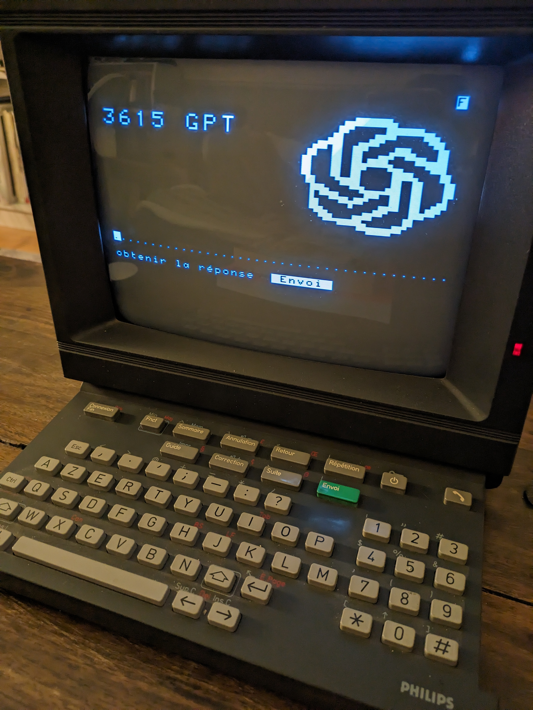

# 3615 GPT

[Version française](.)

J'ai récemment récupéré un minitel et je me suis dit que j'allais essayer d'en faire un petit terminal pour afficher la météo, ou mes messages. Ca ne m'a pas trop étonné de découvrir que beaucoup de hackeurs se sont déjà penché sur la question, et pour le plus gros de ce projet, il m'a suffit de suivre diverses instructions sur le net.

D'abord, l'adaptateur USB, copié de: [Un minitel comme terminal linux USB. Partie 1 : Hardware](https://pila.fr/wordpress/?p=361). Je suis loin d'avoir le talent de soudeur de pila, donc mon adaptateur est légèrement plus gros...

Ensuite le logiciel. Je ne voulais pas un simple tty, je voulais vraiment recréer le look graphique du minitel, avec les caractères semi-graphiques et la double taille, que l'on ne peut recréer avec un simple émulateur VT100. Donc je suis passé à [PyMinitel](), une impressionnante librairie Python qui permet de controller un minitel, entrée, sortie, couleurs, etc. Bravo [zigazou]().

Histoire de faire mes développements sans minitel, j'ai crée une petite
librairie qui permet d'émuler un écran minitel, compatible avec PyMinitel. Grace
à pygame, la fonte minitel, une seconde fonte semi-graphique, ca peut afficher ca:

Pour la connection à ChatGPT, j'utilise la librairie fournie par OpenAI et c'est vraiment très simple.

Et voilà ce que ca donne:

<iframe width="600" height="1067" src="https://www.youtube.com/embed/4mqJF_qJgYU" title="3615 GPT" frameborder="0" allow="accelerometer; autoplay; clipboard-write; encrypted-media; gyroscope; picture-in-picture; web-share" allowfullscreen></iframe>

