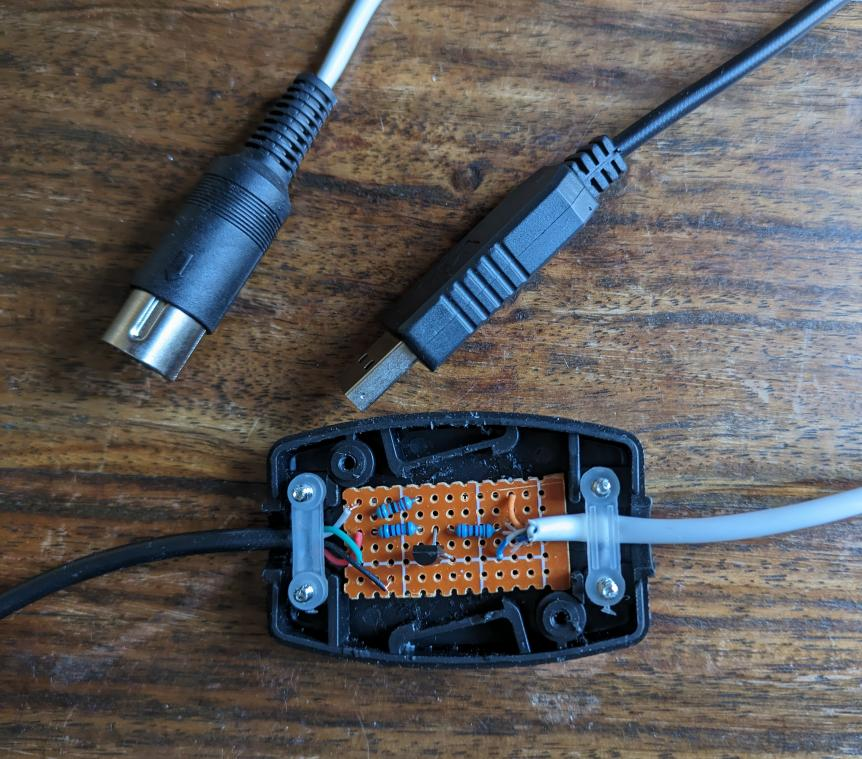

# 3615 GPT

by Max F ([github](https://github.com/maxf/), [mastodon](https://mastodon.social/@maxf))

- [Version française](.)
- [demo](#demo)
- Code: [maxf/minitel](https://github.com/maxf/minitel)

I was recently given an old [minitel](https://en.wikipedia.org/wiki/Minitel), which I thought I might be able to use as a kind of dashboard that shows the time, weather, messages, etc. It didn't surprise me too much to find that quite a few people had already been hacking on the minitel, which made it easy for me to carry out this project by following whatever I found that someone else had done before.

To start with, I made a USB adapter by following the instructions in [Un minitel comme terminal linux USB. Partie 1 : Hardware](https://pila.fr/wordpress/?p=361). My soldering skills are nowhere as good as pila's, so my adapter is a tiny bit bigger...

Then I started on the software. I didn't want to just use basic ASCII terminal features, I really wanted to be able to use the original Minitel features, including the double-size text, the graphics characters, etc, that you can't emulate via a basic VT100 terminal. And I found [PyMinitel](https://github.com/Zigazou/PyMinitel), an impressive library that can control a minitel, with both input and output, fonts, colors, etc, everything I need.

In order to develop the application without needing to plug in the real minutel, I wrote a small library that emulates a minitel screen, compatible with PyMinitel. Thanks to pygame, the [minitel font](https://github.com/Zigazou/Minitel-Canvas), an extra [graphical-characters font](https://github.com/dokutan/legacy_computing-font), we can display this:

At some point I changed my mind and started coding a ChatGPT interface, as a fun way to combine old and new tech. This was fairly easy to implement, using the python library provided by OpenAI.

## Demo

Here's the result:

    
    
    

<iframe width="560" height="315" src="https://www.youtube.com/embed/lIALUU8-Oxo" title="YouTube video player" frameborder="0" allow="accelerometer; autoplay; clipboard-write; encrypted-media; gyroscope; picture-in-picture; web-share" allowfullscreen></iframe>

## Code

Everything's at [maxf/minitel](https://github.com/maxf/minutel)
