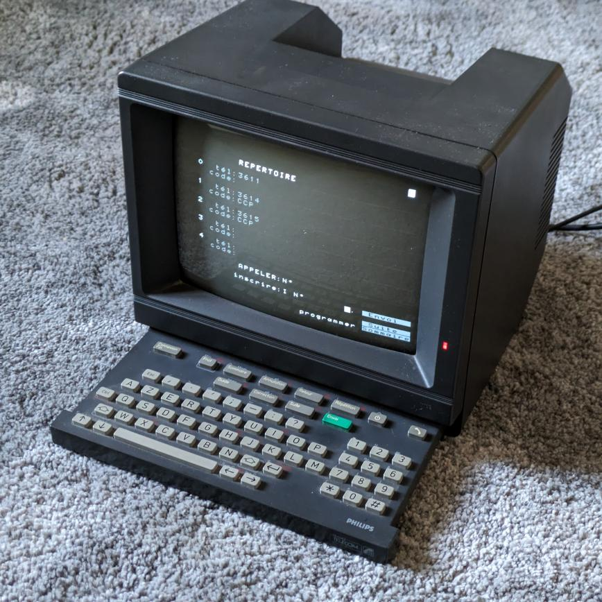
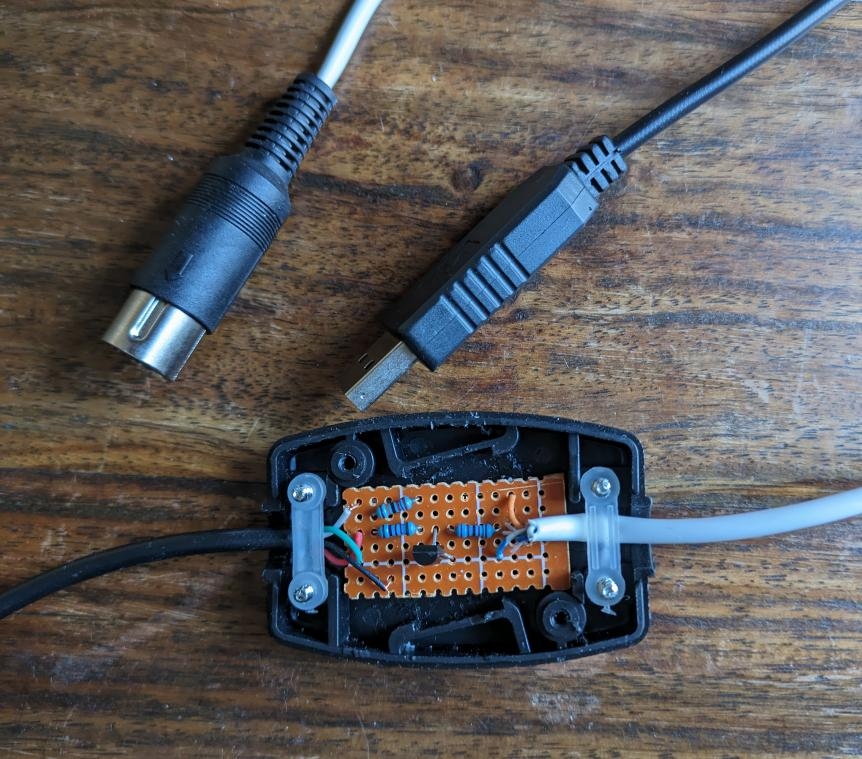
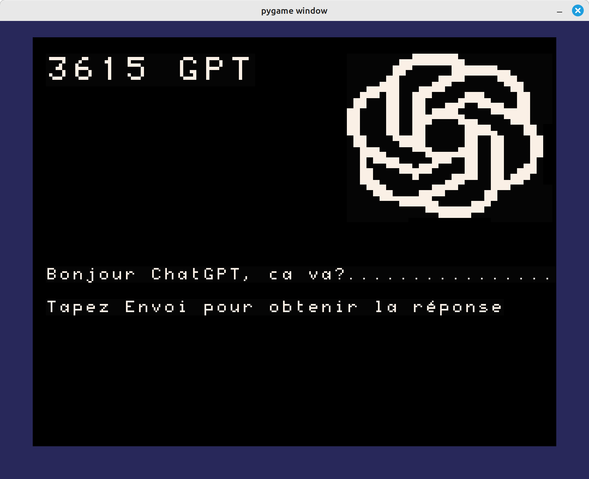
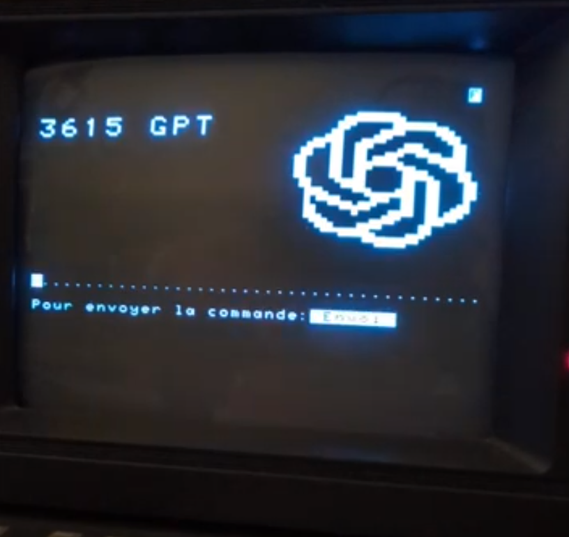
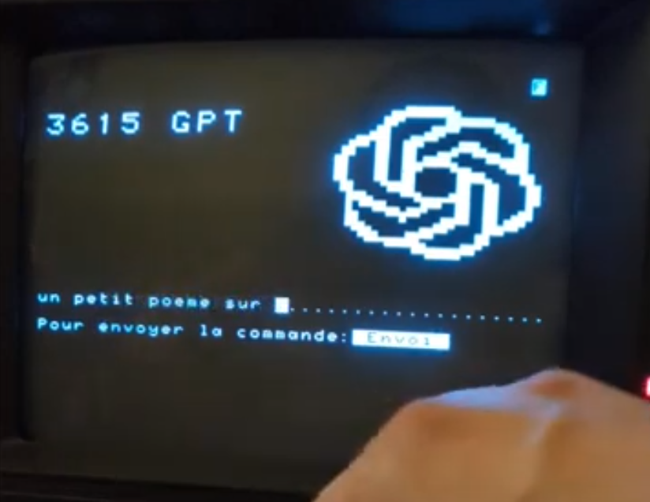
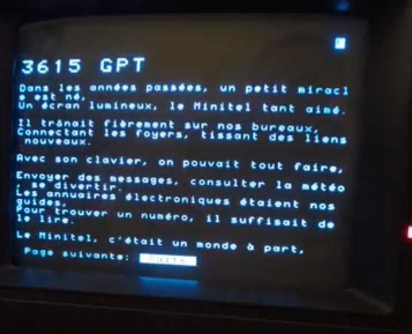

# 3615 GPT

par Max F ([github](https://github.com/maxf/), [mastodon](https://mastodon.social/@maxf), max@e97.me)

- [English version](index.en.md)
- [démo](#demo)
- Code: [maxf/minitel](https://github.com/maxf/minitel)

J'ai récemment récupéré un minitel et je me suis dit que j'allais essayer d'en
faire un petit terminal rétro pour afficher la météo, les news, mes messages,
etc. Quand j'ai commencé, ça ne m'a pas étonné de découvrir que beaucoup de
hackers se sont déjà intéressés à la question, et pour le plus gros de ce projet
il m'a suffi de suivre diverses instructions sur le net.

D'abord, l'adaptateur USB, copié de: [Un minitel comme terminal linux
USB. Partie 1 : Hardware](https://pila.fr/wordpress/?p=361). Je suis loin
d'avoir le talent de soudeur de pila, donc mon adaptateur est légèrement plus
gros...

Ensuite le logiciel. Je ne voulais pas utiliser un simple terminal ASCII, mais
vraiment pouvoir utiliser l'interface graphique typique du minitel: les
caractères semi-graphiques, la double taille horizontale et verticale, etc, que
l'on ne peut recréer avec un VT100 de base. J'ai trouvé
[PyMinitel](https://github.com/Zigazou/PyMinitel), une impressionnante librairie
Python qui permet de controller un minitel, avec entrée, sortie, couleurs, et
qui permet d'utiliser toutes les fonctionalités de l'affichage.

Histoire d'écrire mon code sans avoir à sortir et brancher le minitel à chaque
fois, j'ai écrit une petite librairie qui permet d'émuler l'écran, compatible
avec PyMinitel.  Grace à pygame, la [fonte minitel](https://github.com/Zigazou/Minitel-Canvas), une [fonte
semi-graphique compatible](https://github.com/dokutan/legacy_computing-font), ca peut afficher ca:

A un moment donné j'ai changé d'avis et j'ai décidé de faire une interface pour ChatGPT, une espèce de version rétro, appelée "3615 GPT".

Pour la connection à l'API ChatGPT, j'utilise la librairie python fournie par
OpenAI et c'est vraiment très simple: envoyer le prompt, recevoir la réponse, c'est tout.

## Demo

Et voilà ce que ca donne:

    
    
    

<iframe width="560" height="315" src="https://www.youtube.com/embed/bjgSRb4fNNs" title="YouTube video player" frameborder="0" allow="accelerometer; autoplay; clipboard-write; encrypted-media; gyroscope; picture-in-picture; web-share" allowfullscreen></iframe>

