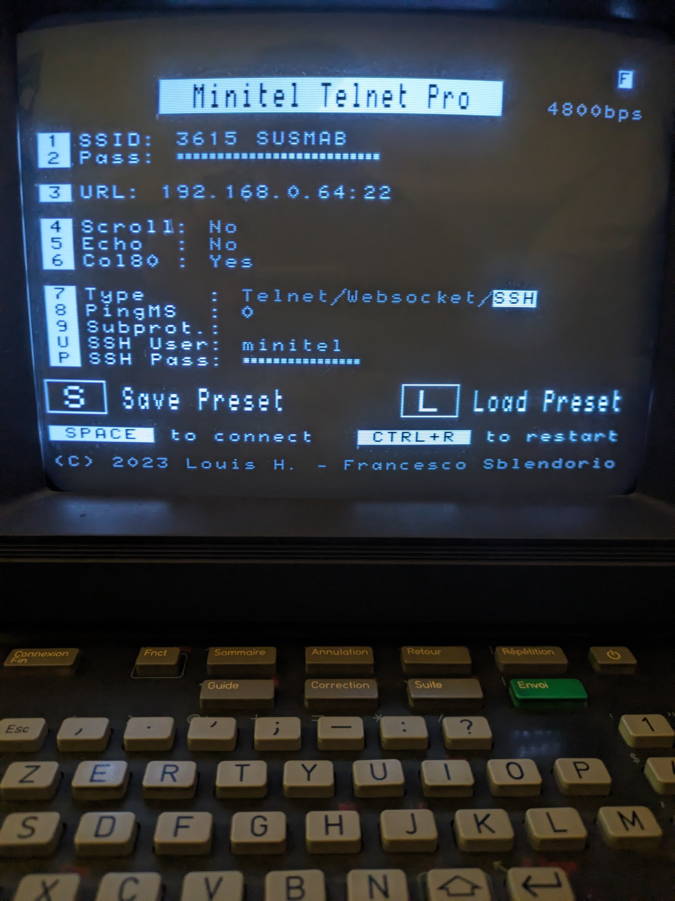
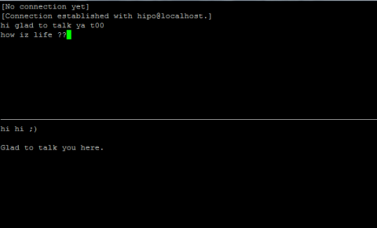
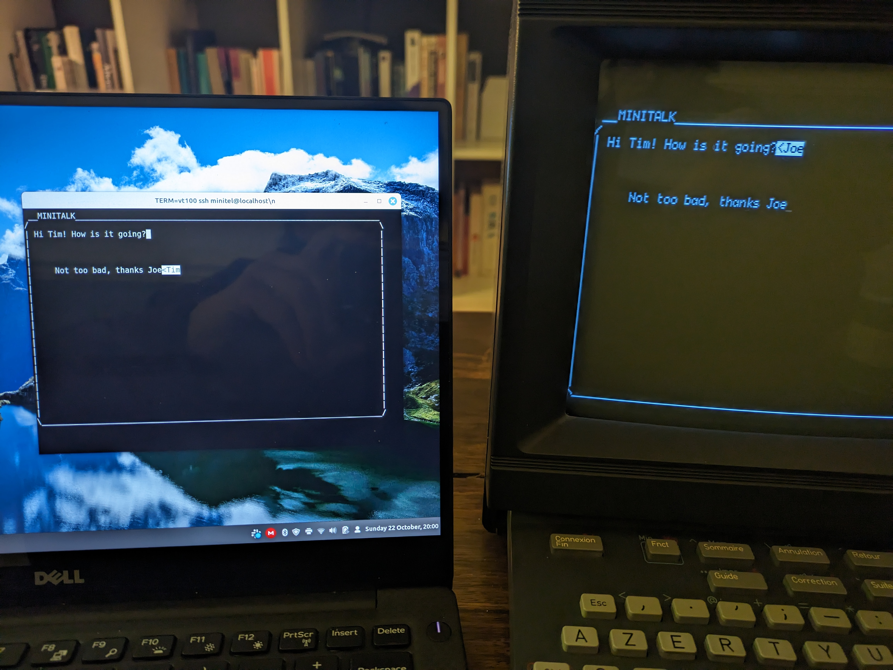

# Minitalk

by MaxF ([github](https://github.com/maxf/), [mastodon](https://mastodon.social/@maxf), max@e97.me)

- Code: [maxf/minitel](https://github.com/maxf/minitel)
- [Instructions](https://github.com/maxf/minitel/blob/main/minitalk/README.md)

After [3615 GPT](..), conversations with [danbri](https://github.com/danbri) led me to want to implement some sort of chat system that could let a Minitel user chat with another Minitel. I'll spare the reader all the considerations and decisions that went into this and will just outline the way I did it.

## Hardware

I didn't use the same serial cable as with [3615 GPT](..), but went for the [Minitel ESP32 dongle](https://hackaday.io/project/180473-minitel-esp32) (thanks again Dan for pointing me to it), a very nice little device that plugs into the DIN socket at the back and can do lots of very nice things, but in particular connect to a WiFi network and run an SSH client. This is a lot more convenient than the cable.

 

## The SSH clients

We need a server PC, which runs an SSH server. Every Minitel (or indeed any computer connecting via SSH using a terminal) can connect to the sshd server. The server is configures to run [`client.py`](../../minitalk/client.py), instead of a normal shell. Upon starting, `client.py` asks for a username and lets the user join the chat.

## The talk server

Each `client.py` programme connects to a server: [`server.py`](../../minitalk/server.py), which manages the canvas and dispatches each keypress received from each client to every other client. Clients and server communicates via simple Unix sockets.

## 2D chat

Instead of reusing something like IRC, I remembered the Unix [talk](https://www.pc-freak.net/blog/enabling-talkd-console-chat-between-logged-in-users-on-freebsd-and-other-bsds/) command, that let two terminal users chat in full-duplex, split screen mode: every character one of them would type would immediately show on the other's screen, leading to a very different way of chatting than common other messenging systems.

That way of chatting doesn't work so well with much more than 2 users, so my idea was to have a single canvas where all connected clients could just write anywhere. A bit like collaborative editors like Google Docs.

`client.py` implements that: all clients see the same screen, except small labels that show you who is writing where. This is how it looks when both a PC and a Minitel are connected:

## Minitel-specific characters

I chose not to use Minitel-specific features like double-size chars and "semi-graphical" characters, because it would be a lot of work to find the best way for the user to use them in chat. And it would make it very difficult to interact with non-Minitel terminals who don't have those features. So unlike 3615 GPT, this is lacking the signature Minitel screen look-and-feel.

## The end

Well that was quite fun to write. And for the first time, I used ChatGPT to write substantial portions of the code and to help me write the rest. I knew nothing about socket programming in python and it just wrote all the code for me.
